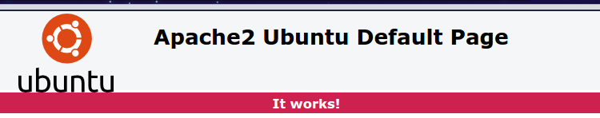

# create a simple server using apache2

Since the goal of the existing of package manager is to install and update the binaries on the target image without building the image again with updated version of binaries. we need to create a server which hosts our debain files.
For the purpose of simplicty, i will convert my machine to a server using apache2.

first, install apache2 on your machine
```sh
$ sudo apt-get install apache2 
```

After installing apache2, apache2 creates a folder in **/var/www/html** (This is where apache2 server running from) which means if i am accessing this server from another place, it will direct me to this folder. So to test that apache2 is running,type in your browser 
```
http://<your public IP>/index.html 
```
Probably, you will see it loading without showing anything. This is because your gateway(i.e home router) is not configured to forward http requests to your machine (i.e laptop). you need to search about how to configure your router port forward. It is usually exist in a section called **port forwading** where you can add a rule for forwarding as the below shown image.

<p align="center">
  
</p>
you can get your public IP from command line with 

```sh

wget http://ipecho.net/plain -O - -q ; echo

```
let's say that the public IP was 156.xxx.xxx.xxx. so, if you type in the browser ** http://156.xxx.xxx.xxx/index.html ** then your router will forward the request to server local IP (in this case, it was 192.168.1.6) then it will shown the below image. 

<p align="center">
  
</p>

now, the server is ready for access. let's create a directory which contain deb files so it will be accessible from outside world.
As a good practice, it is recommended to create the folder in another place(you prefer) rather than /var/www/html and make a symbolic link to it.

```sh
$ mkdir /home/yahia/Desktop/elinux_dev/yahia-deb/
$ ln -s /var/www/html/my-repo /home/yahia/Desktop/elinux_dev/yahia-deb/
```
yahia-deb is where i keep my developed packages with released versions which will be online.

create two directories inside my-repo *deb_packages* where you develop your softwares that will be converted later to deb files and the second one *yahia-repo* (or whatever you like)  is where our final deb package will be exist.
```sh
$ mkdir deb_packages yahia-repo
```

In the next post, I will explain how to [make a deb package](create-a-deb-package-file.md) from your binary. 
